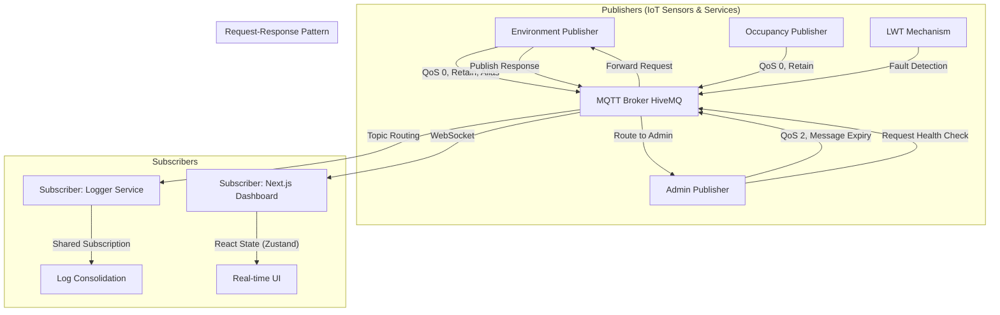

# 🎓 Smart Campus Monitoring System (MQTT v5 Integration)

- Ahmad Yazid Arifuddin (NRP 5027241040)
- Evan Christian Nainggolan (NRP 5027241026)
---

## 📝 Deskripsi Singkat
Proyek ini merupakan implementasi sistem monitoring **Smart Campus** berbasis arsitektur *event-driven* menggunakan protokol **MQTT v5**. Sistem ini mensimulasikan berbagai sensor IoT (suhu, kelembaban, okupansi) dan layanan administratif yang saling terintegrasi untuk memberikan informasi *real-time* mengenai kondisi kampus. Fokus utama proyek ini adalah mendemonstrasikan fitur-fitur lanjutan MQTT v5 untuk optimasi *bandwidth*, keandalan pengiriman data (*Fault Tolerance*), dan manajemen beban sistem (*Flow Control*).

---

## 🏗️ Arsitektur Sistem
Sistem ini mengadopsi pola mikrolayanan terdistribusi dengan komponen sebagai berikut:

---

## 🌳 Design Topic (Topic Tree)
Hierarki topik dirancang secara *scalable* menggunakan struktur yang mencerminkan fisik kampus:

- **`campus/`** (Root)
    - **`environment/`** (Data Telemetri)
        - `+/temperature` (Single-level wildcard untuk ID Ruangan)
        - `+/humidity`
    - **`occupancy/`** (Data Kehadiran)
        - `+/capacity`
    - **`system/`** (Status & Kontrol)
        - `+/status` (Digunakan untuk LWT)
        - `request/health` (Input Request-Response)
        - `response/health` (Output Request-Response)
    - **`alerts/`** (Peringatan Keamanan)
        - `warning/#` (Multi-level wildcard untuk kategori peringatan)
    - **`announcements/`** (Informasi Publik)
        - `broadcast`

---

## ✨ Fitur-Fitur Utama (MQTT v5 Implementation)

1.  **Wildcard & Topic Hierarchy**: Memudahkan skalabilitas sistem sehingga penambahan sensor baru tidak memerlukan perubahan pada sisi subscriber.
2.  **Retained Message**: Memastikan Dashboard langsung menampilkan data terakhir saat baru dibuka (*instant-load*) tanpa menunggu siklus pengiriman sensor berikutnya.
3.  **Message Expiry**: Pesan pengumuman atau alert memiliki masa berlaku otomatis, mencegah penumpukan data usang di sisi broker.
4.  **User Properties (Metadata)**: Penambahan konteks data (seperti lokasi gedung atau tipe sensor) di dalam *header* pesan tanpa memodifikasi isi *payload*.
5.  **Topic Alias**: Mengurangi ukuran paket data dengan mengganti string topik yang panjang menjadi indeks angka untuk menghemat *bandwidth*.
6.  **Last Will and Testament (LWT)**: Deteksi otomatis status "Offline" jika layanan publisher mengalami kegagalan koneksi mendadak.
7.  **Request-Response Pattern**: Implementasi komunikasi dua arah yang sinkron (seperti HTTP) di atas protokol asinkron MQTT menggunakan `responseTopic` dan `correlationData`.
8.  **Shared Subscription**: Distribusi beban pemrosesan log (`$share/`) ke beberapa instans logger untuk mencegah *bottleneck*.
9.  **Flow Control**: Penggunaan `receiveMaximum` untuk membatasi jumlah pesan yang diproses secara konkuren guna mencegah *system overload* (OOM).

---

## 📊 Dashboard Monitoring
Dashboard dibangun menggunakan **Next.js** dan **Zustand** dengan fitur utama:

- **Environment Monitoring**: Visualisasi *real-time* suhu dan kelembaban dalam bentuk kartu informatif.
- **Occupancy Tracker**: Pemantauan kapasitas ruangan dengan indikator visual.
- **System Status Panel**: Memantau status kesehatan (Online/Offline) semua layanan menggunakan integrasi LWT.
- **Alert & Announcement Center**: Menampilkan notifikasi darurat dan pengumuman administratif secara dinamis.
- **Interactive Filtering**: Filter data berdasarkan lokasi atau ruangan spesifik untuk mempermudah observasi.
- **Metadata Inspector**: Kemampuan untuk melihat *User Properties* dari setiap pesan yang masuk untuk kebutuhan debugging atau informasi detail.

---

## 📸 Dokumentasi (Screenshots)

*Berikut adalah visualisasi sistem yang perlu dilampirkan dalam laporan:*

### 1. Main Dashboard Overview

*Tampilan utama dashboard yang menunjukkan metrik suhu, kelembaban, dan okupansi secara real-time.*

### 2. Monitoring Status Sistem (LWT)

*Bukti implementasi Last Will and Testament, menunjukkan perubahan status menjadi "Offline" saat service publisher dimatikan.*

### 3. Notifikasi & Metadata (User Properties)

*Detail alert yang menampilkan informasi tambahan (lokasi, tipe sensor) yang diambil dari User Properties MQTT v5.*

### 4. Simulasi Flow Control & Overload

*Log pada terminal backend yang menunjukkan pembatasan jumlah pesan (receiveMaximum) saat terjadi lonjakan trafik.*

### 5. Fitur Interaktif (Filtering)

*Dashboard saat menggunakan fitur filter untuk memantau ruangan atau gedung tertentu secara spesifik.*
